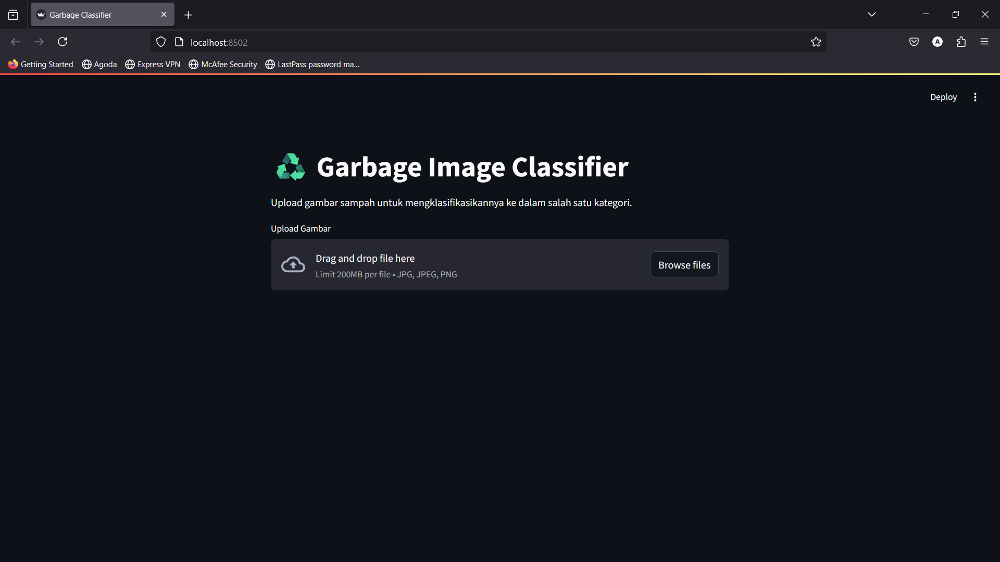

Demo Tentang Mengklasifikasikan Jenis sampah 
1. Cardboard
2. Glass
3. metal
4. Paper
5. Plastic
6. Other

Demo ini menggunakan Convolutional Neural Networks (CNN) dan Dataset dari TrashNet , yang terdiri dari 2.527 gambar sampah dalam 6 kategori: karton, plastik, kertas, kaca, logam, dan limbah campuran. Dataset dibagi menjadi train (70%), validation (15%), dan test (15%). 
LINK https://www.kaggle.com/datasets/fathurrahmanalfarizy/sampah-daur-ulang

Arsitektur model yang di pakai 
1. MobileNetV2
2. Dense (512 neuron, aktivasi ReLU) 
3. Dropout (0.5)
4.  Softmax 

